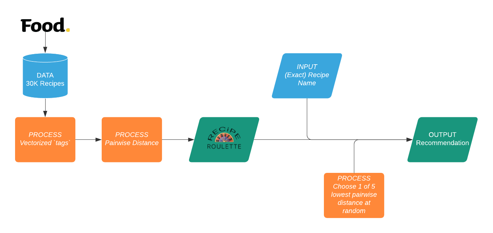
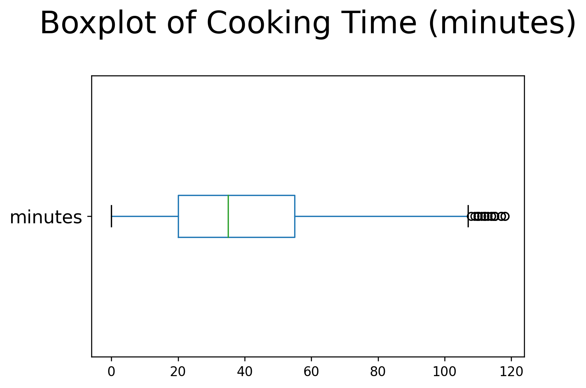
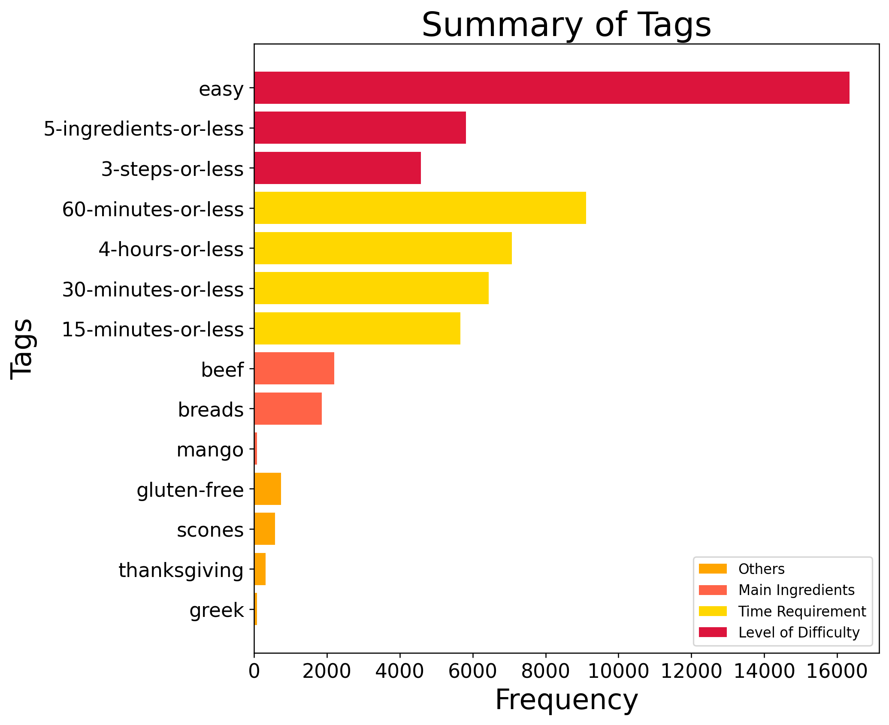
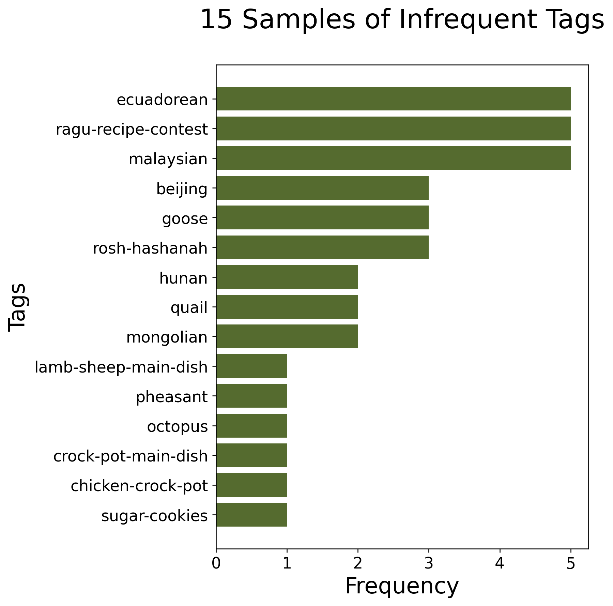
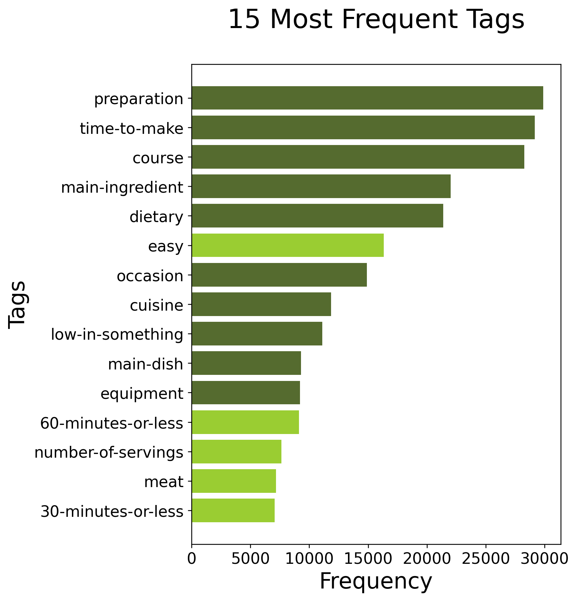

Author: Dina Bahar

---
### Problem
The COVID-19 outbreak impacted people in many ways. When the lockdown orders were rolled out, everyone had to adjust their lifestyles. "Overwhelmed" is a word commonly used when people talk about how they've been adapting to the new normal. Besides wearing masks, incessant handwashing, and working remotely, lots of people have to start cooking their own meals whether they like it or not.

After a long day of working on your dining table, one is often decision fatigued. With everything that's on the internet nowadays, browsing for dinner recipes can feel like a chore and that is why I built the RECiPE ROULETTE. 

Leave it to RECiPE ROULETTE to recommend you one recipe at a time, based on the recipes you've enjoyed, so you can make decisions on the important things.

---
### Goal
Build a recipe recommender for users to input the recipe that they liked and get 1 recommendation at a time, like Google's "I'm Feeling Lucky" button.

I decided to build an item-based recommender system because users' tastes will affect what they rate highly. What one user would give a 5-star rating, might not be what another user with opposing taste would give.

---
### Data
This project is built off of this [Kaggle dataset](https://www.kaggle.com/shuyangli94/food-com-recipes-and-user-interactions), posted by Shuyang Li, consisting of 200K+ recipes and 700K+ recipe reviews covering 18 years of user interactions and uploads on Food.com. 
> What started as an idea to connect home cooks from all over the world has grown into a daily cooking community, featuring 500,000+ user-generated recipes, 125,000+ photos, millions of reviews and tweaks. (Source: [Food.com Wikipedia](https://en.wikipedia.org/wiki/Food.com))

The data is appropriate because, according to Wikipedia, Food.com is a platform *for* home cooks (myself included) to find recipes. And for this project, I am only using the following data from `RAW_recipes.csv`,

| Column      | Type   | Description                     |
|-------------|--------|---------------------------------|
| name        | String | Recipe name                     |
| id          | Int    | Recipe ID                       |
| minutes     | Int    | Minutes to prepare recipe       |
| tags        | String | Food.com tags for recipe        |
| steps       | String | Text for recipe steps, in order |
| ingredients | String | List of ingredient names        |

---
### Methodology

The flowchart above gives an overview of how I built the recipe recommender. Starting with the Food.com data, I binarize the `tags` columns so I can calculate the pairwise distances. As a refresher on the pairwise distance metric, 

> Pairwise methods evaluate all pairs of sequences and transform the differences into a distance. This essentially is a data reduction from a possibly many state difference to a single number. (Source: [Beerli, 1](https://people.sc.fsu.edu/~pbeerli/BSC-5936/10-26-05/lecture_15.pdf))

Thus, the smaller the distance between two recipes, the more similar they are in features. The recommender system is a matrix of recipe names and their pairwise distances to each other in a `DataFrame` format. To get a recommendation, a user inputs the name of the recipe that they liked and the recommender will output a recipe with as little pairwise distance as possible to the input recipe.

The idea is that, the user can run the recommender again if they don't like what's commended because tastes may vary. This means that the user might not always get the most similar recipe, but a recipe -picked at random- out of 5 objectively similar recipes.

---
### Challenges
**Limitations**: Computer storage (RAM)   
Only 28 KB is available to build the recommender system. This means working with 30K rows instead of 200K+.

**Assumptions**: Exclusivly using Food.com data   
This recommender assumes that users exclusivly look to Food.com for recipe ideas. In reality, consumers will browse several websites before committing to one recipe.

---
### Software Requirements
Besides Pandas, NumPy, and Matplotlib, I'm utilized the following softwares,

| Software         | Description                      |
|------------------|----------------------------------|
| Google Colab Pro | To run RAM-intense codes         |
| Scikit-learn     | For the pairwise distance method |
| SciPy            | To store data in CSR matrix      |
| Termcolor        | To format recommender output     |
| OS               | To read in functions.py          |

---
### Findings

#### i. Cleaning & EDA
During data cleaning and EDA, I found recipes that that require up to 3 months to prepare. Based on the boxplot below, recipes beyond 2 hours (rounded up)  are considered outliers because they are beyond the upper extremes (upper whisker). These outliers amount to 11% of the 30,000 data.

However, the outliers in this sample are all justified because if the recipes involves braising, fermenting, smoking, or freezing then they are inevitably time-consuming. The following are a quotes from recipe instructions, `steps`, to support,

| Justified | Name                     | Cooking Time | Quote                                                                         |
|-----------|--------------------------|--------------|-------------------------------------------------------------------------------|
|    YES    | Garden Minestrone        | 12.0 hour    |Cover and cook until beans are tender , 9-11 hours on low or 5-7 hours on high |
|    YES    | Salad Bar Antipasto      | 1.0 day      | Seal the bag and refrigerate for 24 hours , turning bag occasionally.         |
|    YES    | Homemade Creme De Menthe | 1.0 month    | Age for a month.                                                              |
|    YES    | Nut Wine                 | 3.0 month    | Make a mixture of the nuts and alcohol and have it sit for 3 months           |

#### ii. Feature Selection
For my recommender system, I'm only using `tags` as my variables because they already comprise of the most relevant features:

&#x2611; Level of Difficulty   
&#x2611; Time Requirement   
&#x2611; Main Ingredients   
&#x2611; Others (Cuisine, food type, dietary restrictions, occasions)

The bar chart below summarizes the different tags available.

The top half are *all* tags regarding recipes' Level of Difficulty and Time Requirement, whereas the bottom half are *samples* of tags regarding Main Ingredients of the recipe, and *samples* of miscellaneous tags (Others) to summarize the kinds of tags available as recipe features.

Moreover, because the recommender system relies solely on the `tags`, I dropped the ones that were too infrequent and too frequent. The dark green labels on the bar chart below means the tags does not differentiate recipes that well, and hence invaluable. 

On the left is the *15 Samples of Infrequent Tags* chart with *samples* of the 97 `tags` that have 5 or less recipes tagged with it. 5 or less recipes is not enough recipes to compare and recommend from. Hence, these tags are removed from my data.

Additionally, we can see on the chart on the right, which has the top 15 most popular tags, sorted from largest to smallest. The more popular `tags` can be too generic to be valuable. For example 'preparation', 'time-to-make', 'course', and more in dark green. We see more interpretable and useful tags towards the bottom 4, starting with '60-minutes-or-less'. Hence, these tags are removed from my data as well.

---
### Product

The final product is a matrix of recipe names and their pairwise distances to each other in a `DataFrame` format. To get a recommendation, a user inputs the name of the recipe that they liked and the recommender will output one of the five recipes with minimal pairwise distances. 

You can find this working recommender towards the end of the `2_recommender.ipynb` notebook. I have also included 10 sample recipe names that are available for you to choose from the 30K recipes included in this prototype. 

Lastly, the only way to evaluate a recommender system is by trying it out and evaluating the recommendations yourself. And from the handful of times that I used the recommender, the output has made sense.

---
### Next Steps
To close, while I met my goal to build a recipe recommender, there are various ways to improve the product so that it can be more accessible to everyone. Below are a few next steps:
- Scrape recipes from other sources
- Clean ingredients list
- Access more RAM
- Build flask app
